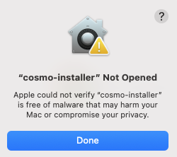

# ESS-PLUGIN: JUICE observations synergies workshop (2026-01)

⚠️ ***Due to the recent ESA security incident, this instruction manual has been created to reflect the temporary workarounds for the workshop.***


## 🛠️ Configuring the plugin (only first time)

* Getting the JUICE SPICE Kernels
* Setting up the SKD
* Getting Cosmographia
* Getting the Cosmographia plugin
* Setting up the Cosmographia plugin


### 1. Getting the JUICE SPICE Kernels

⚠️ Temporary workaround⚠️

The latest version of the SKD's operational sub-set -including only the latest kernels listed on the metakernel- can be obtained via:

[Direct Download](https://spiftp.esac.esa.int/data/SPICE/JUICE/misc/skd/JUICE.zip) (Zip file with the latest version of the JUICE SKD in Git)
Browse the kernels individually

```
https://spiftp.esac.esa.int/data/SPICE/JUICE/misc/skd/JUICE.zip
```

### 2. Setting up the SKD

* Unzip the JUICE SKD zip file on your filesystem.

⚠️ ***SPICE toolkit has limitations on path lengths. Try to to keep the path as short as possible unziping the JUICE SKD near your filesystem root.***

 * Configure the local metakernel paths. This step creates a working copy of the metakernel (local) that can be used directly by the plugin and the spice toolkit. A convenience **command line tool** is provided for this purpose in the SKD.

#### 🍎 macOS / 🐧 Linux

```
$ cd <JUICE_SKD_PATH>
$ ./misc/git_hooks/skd_post_merge/update_local_mks.sh
```

####  🪟 Windows

```
> cd <JUICE_SKD_PATH>
> copy misc\git_hooks\skd_post_merge\update_local_*.bat  misc\git_hooks
> misc\git_hooks\update_local_mks.bat
```

### 3. Getting and installing Cosmographia

 The latest version ***4.2*** of SPICE-enhanced Cosmographia for the different flavour of OS are available in the https://www.cosmos.esa.int/web/spice/cosmographia site.

It is also available for download from the NAIF website at http://naif.jpl.nasa.gov/naif/cosmographia_components.html.


#### 🍎 macOS

1. **Download the Mac OSX DMG**
[SPICE-enhanced Cosmographia for Mac OSX (64-bit) (528 MB)](https://spiftp.esac.esa.int/cosmographia/cosmo-installer-4.2-osx.dmg) Compatibility: OS X 10.15 or later

2. **Open the DMG**
3. **Execute the installer**

⚠️ In some systems the installer may show a warning, preventing the execution of the installer. 

<center></center>


To workaround this issue, the installer must be extracted into a temporary folder (e.g. Downloads) and execute the following commands in a terminal:
```
$ xattr -d  com.apple.quarantine cosmo-installer.app/
$ ./cosmo-installer.app/Contents/MacOS/cosmo-installer
```
After installing, the temporary installer can be deleted.

2. **Follow the wizard instructions**

⚠️ ***Please, take note of the install folder path, we will use it later.*** 


#### 🐧 Linux

1. **Download the Linux installer**

[SPICE-enhanced Cosmographia for Linux (64-bit) (636 MB)](https://spiftp.esac.esa.int/cosmographia/cosmo-installer-4.2-linux)
Compatibility: Built on a machine running Ubuntu 16, but should run under most modern versions of the Linux operating system such as CentOS, RHEL and SUSE.

2. **Follow the wizard instructions**

⚠️ ***Please, take note of the install folder path, we will use it later.*** 


#### 🪟 Windows

1. **Download the Windows installer**
[SPICE-enhanced Cosmographia for Windows (64-bit) (560 MB)](https://spiftp.esac.esa.int/cosmographia/cosmo-installer-4.2-windows.exe) Compatibility: Windows 10 or later


2. **Follow the wizard instructions**

⚠️ ***Please, take note of the install folder path, we will use it later.*** 


### 4. Getting and installing the ESS Cosmographia plugin

⚠️ Temporary workaround ⚠️

* Clone the plugin repository in the filesystem.

        git clone https://github.com/esaSPICEservice/ess-plugin.git


### 5. Setting up the Cosmographia plugin 

#### 🍎 macOS/ 🐧 Linux

* Open a terminal
* Navigate to the **ess-plugin** repository directory

      $ cd ess-plugin

* Execute the generic launcher script. The first time, it will ask for the full path of the Cosmographia installation. It saves that path in ~/.cosmo_path. On subsequent runs, it uses the saved path automatically. You can reset the saved path anytime, deleting the file.

       $ ./plugin_launcher.sh

After the configuration is completed, cosmographia can be closed, it will be ready for the next session. 


####  🪟 Windows (PowerShell terminal)

* Open a PowerShell terminal
* Navigate to the **ess-plugin** repository directory

      PS> cd ess-plugin
* Execute the generic launcher script. The first time, it will ask for the full path of the Cosmographia installation. It saves that path in .cosmo_path file in your user home folder. On subsequent runs, it uses the saved path automatically. You can reset the saved path anytime, deleting the file.

     PS> .\plugin_laucher.ps1

After the configuration is completed, cosmographia can be closed, it will be ready for the next session. 


## Running the plugin: JUICE PTR


#### 🍎 macOS/ 🐧 Linux

* Open a terminal and navigate to the **ess-plugin** repository directory

      $ cd ess-plugin
* Execute the launcher

      $ .\plugin_laucher.sh juice_ptr

####  🪟 Windows (PowerShell terminal)
* Open a PowerShell terminal and navigate to the **ess-plugin** repository directory

      PS> cd ess-plugin
* Execute the launcher

      PS> .\plugin_laucher.ps1 juice_ptr

## [Extra] Running the plugin: Adding stars


#### 🍎 macOS/ 🐧 Linux

####  🪟 Windows


## Links and Resource

* https://naif.jpl.nasa.gov/naif/ - NAIF homepage
* https://www.cosmos.esa.int/web/spice - SPICE homepage
* https://cosmoguide.org - Extensive guide on Cosmographia
