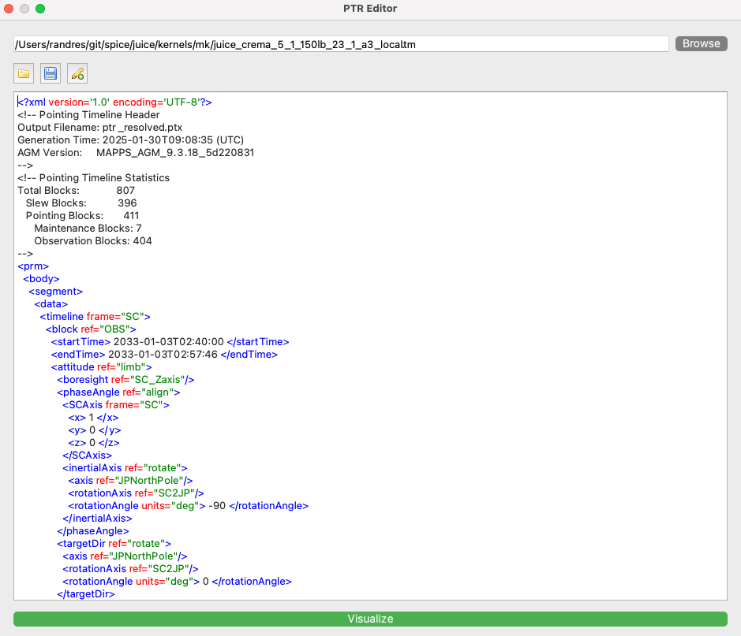
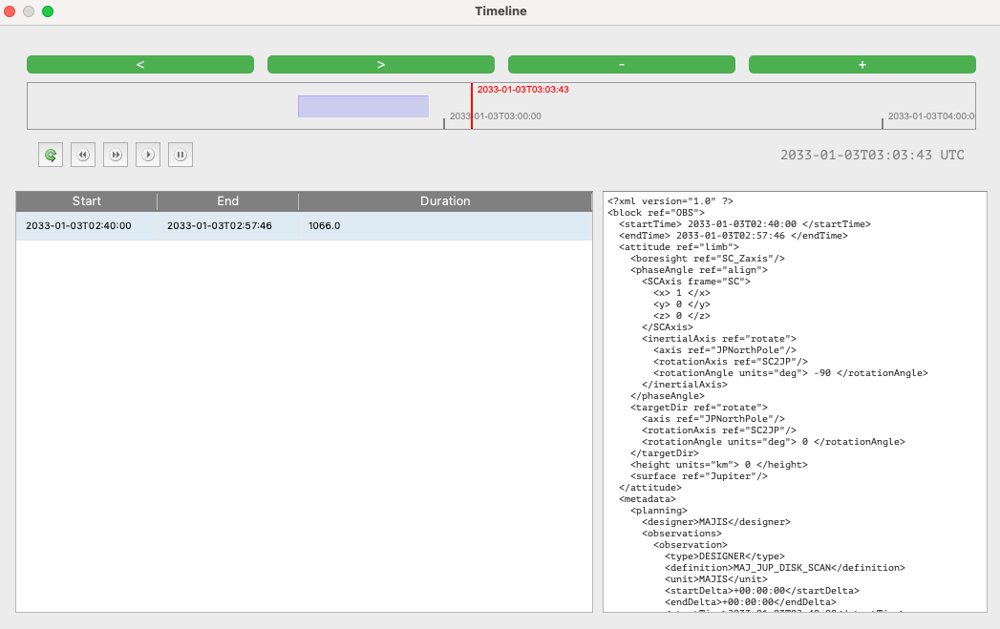
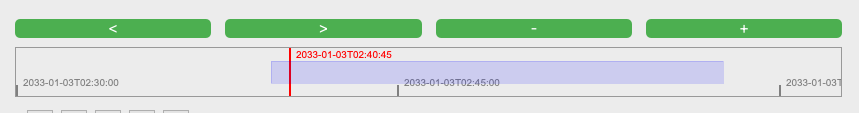
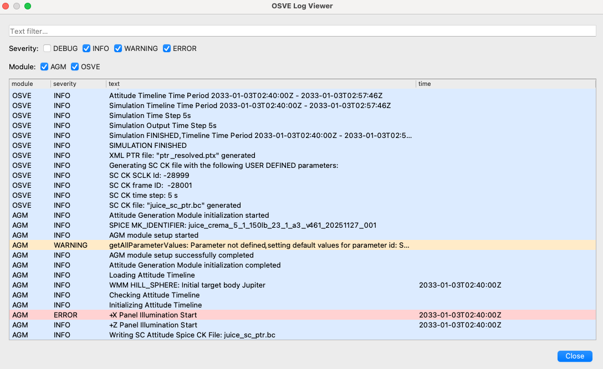
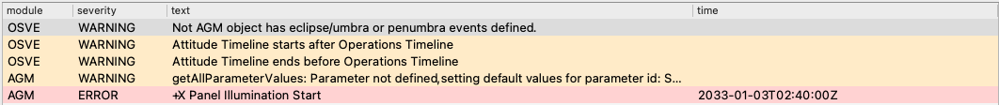
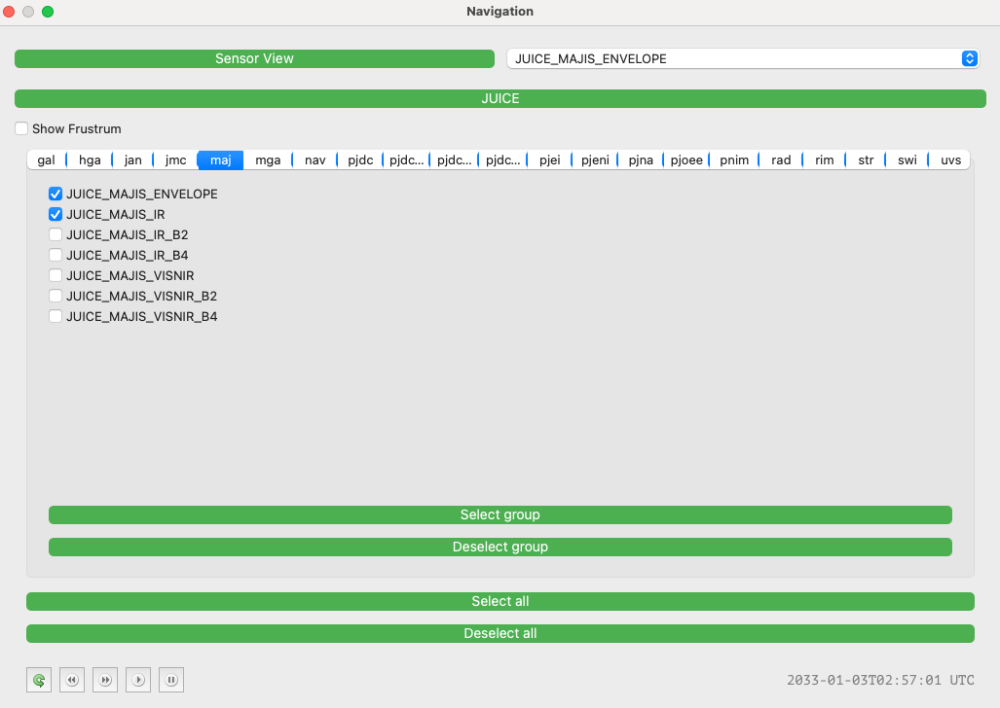
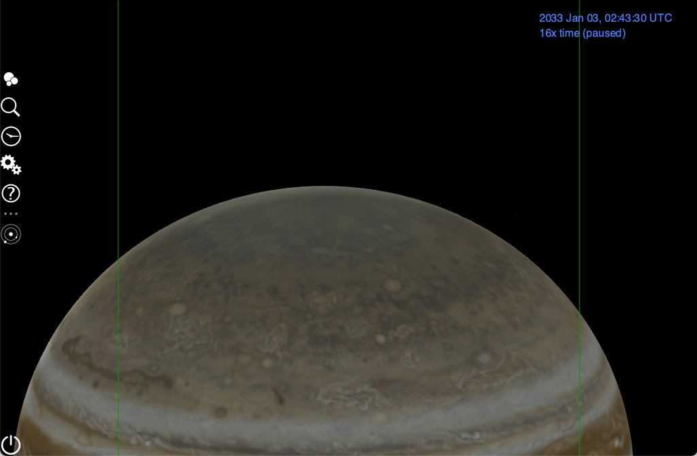
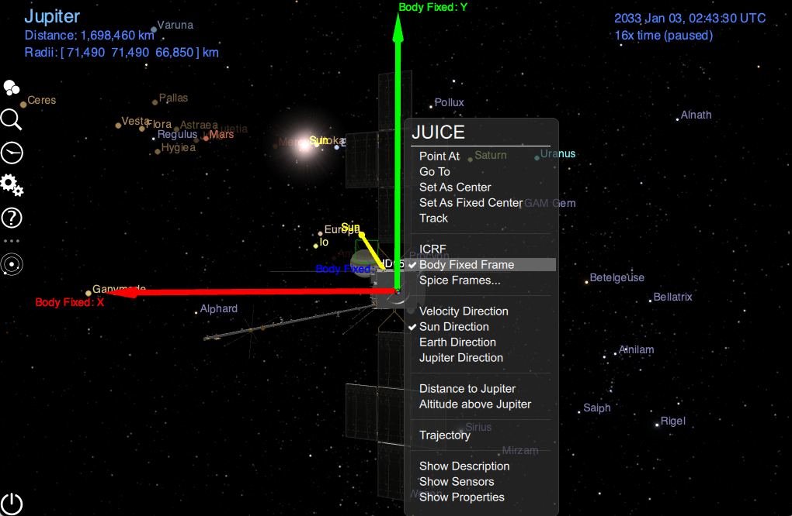
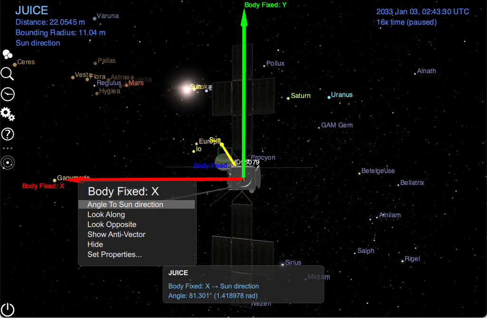

## Exercise 1: Investigating an illumination issue

In this first guided exercise we will learn the basics of using the pointing request editor and the 3D scene to support the creation and analysis of pointing requests.

### 🏃🏼‍♂️‍➡️🏃‍♀️‍➡️ Running the plugin: JUICE PTR

#### 🍎 macOS/ 🐧 Linux

* Open a terminal and navigate to the **ess-plugin** repository directory

      $ cd ess-plugin
* Execute the launcher

      $ ./plugin_launcher.sh juice_ptr

####  🪟 Windows (PowerShell terminal)
* Open a PowerShell terminal and navigate to the **ess-plugin** repository directory

      PS> cd ess-plugin
* Execute the launcher

      PS> .\plugin_launcher.ps1 juice_ptr

### Loading the metakernal and the PTR Editor

To configure an scene we need two elements: 
* the meta-kernel 
* the pointing request file.

The metakernel is the basis for the scene and can be loaded in the tool clicking **Browse** and selecting from your file system. For the example we will use the **juice_crema_5_1_150lb_23_1_a3_local.tm** metakernel that we have previously prepared.

⚠️ Note: The metakernel should be a **local one** 

After defining the metakernel, we shall input a PTR in the editor. The tool provides a lightweight XML editor that behaves like a plain text editor with basic XML awareness. It highlights XML tags, attributes, values, and comments. Indentation is automatic but simple. The editor does not validate XML or use schemas. There is no context-aware auto-completion.

**Typing the @ key** opens a small popup with a fixed list of predefined XML snippets (same contents that in the web pointing tool). Selecting a snippet inserts the corresponding XML template and places the cursor at the appropriate position.

Apart from this, the editor provides only standard text-editing functionality. The editor can load XML content from a file and save the current content back to a file.

When the **Visualization** button is clicked, the editor performs basic syntax checks (such as well-formedness and matching tags). If no show stopper errors are found, the XML content is sent to **OSVE**, the background processor, for further handling.

#### Loading from file
Following with the example, we will load the contents from a file that you can get here attached:

[PTR example](./data/ex01.ptx)

We click on the open button and select the file.

Clicking on the **Visualise** button, it will validate sintactically the request and will send to the background OSVE processor.

### Moving in the blocks (only macOS/linux versions)

In the linux and macOS versions, the tool includes a timeline component used to navigate through the blocks of the request.

The timeline has two parts: a graphical bar and a table. The graphical bar displays each block as a purple segment positioned along the time axis and supports zoom and pan interactions. The table lists the blocks with their time boundaries, duration, and corresponding XML definition.

Clicking the graphical bar or double-clicking on a block start/end cell updates the scene time to the corresponding instant. This is useful to inspect the pointing behavior in the scene along blocks

### Reviewing the OSVE log

Once the scene has been visualized, we shall review the OSVE log. The OSVE log provides details on the execution of the pointing request. It includes the log entries produced by OSVE and any constraint violations detected during execution.

The OSVE log viewer is accessible from the **Pointing → OSVE Log Viewer** menu. It can also be opened quickly using the keyboard shortcut **Alt + L** on Windows/Linux or **Option + L** on macOS.

We can use the filtering functionality to focus on the errors. In the example we can see that the pointing request contains a constraint violation.

### Reviewing the scene

If a constraint violation is detected, it is investigated using the 3D scene to better understand the issue and identify possible solutions. The 3D scene is also used to verify that the pointing behavior matches the expected requirements.

The analysis returns to the 3D scene to first confirm that the pointing is correct. The sensor component is used to display the instrument view and verify that MAJIS is correctly observing Jupiter’s limb.

The sensor component can be displayed using the menu item **Navigation → Sensor**, or by pressing **Alt + S** on Windows/Linux or **Option + S** on macOS.

We configure the view:
* Hidding the frustrum
* Activating the JUICE_MAJIR_IR line and the JUICE_MAJIR_ENVELOPE
* Selecting the JUICE_MAJIR_ENVELOPE view and clicking on the **Sensor View** button.

Once we have confirmed that Jupiter’s limb lies within the MAJIS field of view for the block, the next step is to check the illumination constraint. To do this, we return to the sensor component and select **JUICE** to retrieve the spacecraft-centered view.

We use the standard Cosmographia capabilities to check the illumination. By right-clicking on JUICE, we enable the body frames and the Sun vector. 

Then, we click on **JUICE**, followed by the **Sun vector**, and finally right-click on the +X vector to activate **Angle to Sun Direction**

### OSVE Result Folder

The value obtained confirms the OSVE finding, but further investigation may be needed using external tools or libraries for an analytical analysis with SPICE. To access the CK corresponding to the spacecraft attitude, use the menu **Pointing → OSVE Result Folder** or press **Alt + R (Windows/Linux)** or **Option + R (macOS)**. This opens the OSVE result folder in the system’s file browser.

Additionally, from the same folder we can recover:
* The resolved pointing request: a version of the request where OSVE fills in any block boundaries that were not explicitly defined.
* The complete JSON execution log of the OSVE run.

😈 Hackers’ tip: the parent folder also contains all OSVE configuration and runtime files, which are particularly useful for debugging OSVE errors.

The **CK, together with the metakernel**, contains all the geometrical information used by Cosmographia for the visualization.