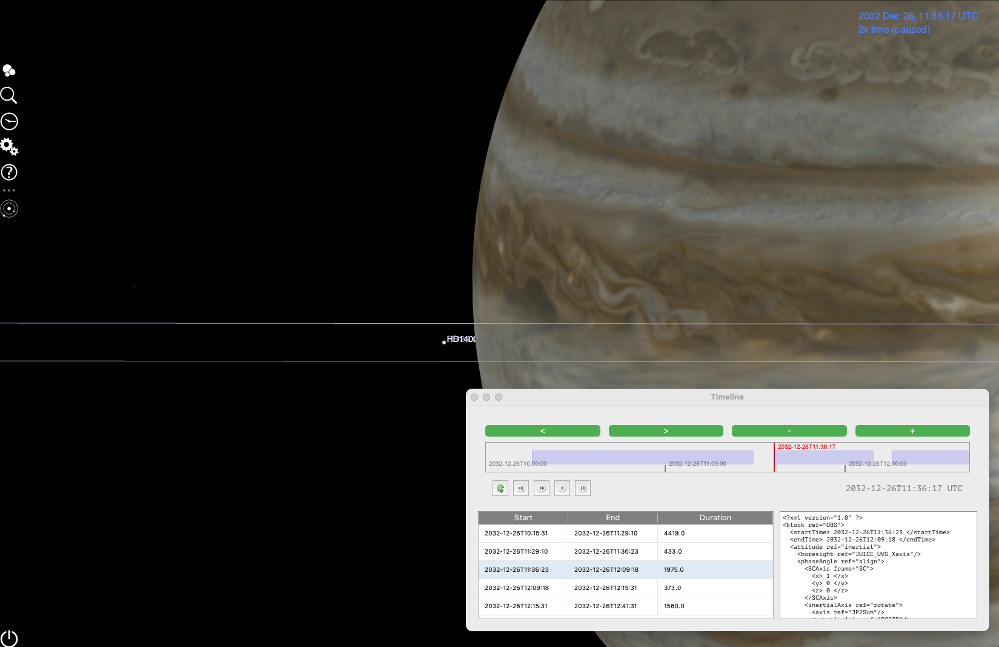

## Exercise 2: Inertial pointing

In this exercise we will use the bases learnt in [exercise 1](ex01.md) to visualize a request that uses an inertial pointing.

### Inputs for the exercise
* Trajectory: juice_crema_5_1_150lb_23_1_a3
* [PTR example](./data/ex02.ptx)

      <block ref="OBS">
                  <startTime> 2032-12-26T11:36:23 </startTime>
                  <endTime> 2032-12-26T12:09:18 </endTime>
                  <attitude ref="inertial">
                     <boresight ref="JUICE_UVS_Xaxis" />
                     <phaseAngle ref="align">
                        <SCAxis frame="SC">
                           <x> 1 </x>
                           <y> 0 </y>
                           <z> 0 </z>
                        </SCAxis>
                        <inertialAxis ref="rotate">
                           <axis ref="JP2Sun" />
                           <rotationAxis ref="SC2JP" />
                           <rotationAngle units="deg"> 180 </rotationAngle>
                        </inertialAxis>
                     </phaseAngle>
                     <target frame="EME2000">
                        <lon units="deg"> 235.671 </lon>
                        <lat units="deg"> -34.7104 </lat>
                     </target>
                  </attitude>
            ...
      </block>

### Preparing the star database

By default, Cosmographia displays only named stars within a limited magnitude range. This behavior can be modified using a plugin that allows labeled points to be shown at any J2000-referenced position. This is particularly useful for checking stellar occultations or planning calibration activities.

#### 🏃🏼‍♂️‍➡️🏃‍♀️‍➡️ Running the plugin: stardb

##### 🍎 macOS/ 🐧 Linux

* Open a terminal and navigate to the **ess-plugin** repository directory

      $ cd ess-plugin
* Execute the launcher

      $ ./plugin_launcher.sh stardb

#####  🪟 Windows (PowerShell terminal)
* Open a PowerShell terminal and navigate to the **ess-plugin** repository directory

      PS> cd ess-plugin
* Execute the launcher

      PS> .\plugin_launcher.ps1 stardb

#### Adding the calibration target to the Cosmographia catalog

From the inertial pointing defined in the request, the information needed for the database entry is extracted. Longitude corresponds to Right Ascension (RA) and latitude to Declination (Dec). Both are expressed in decimal degrees, and the reference frame is J2000 / EME2000.

| Name | Ra J200 (deg)| Dec J200 (deg) |
| --- | --- | --- |
| HD140008 | 235.671 | -34.7104|

 ‼️ The new labelled object will be persistant over the next sessions. If you want to remove it, you shall delete the entry from the database.

### Visualising and analyzing the pointing request

With the basics learnt in [exercise 1](ex01.md): 

Could you visually check that UVS is correctly pointing at the calibration target?

Do you see any problem in the pointing?

Could you get the CK and reproduce the pointing without using the PTR?