## juice_ptr plugin - JUICE pointing request plugin 🎯

The JUICE_PTR plugin is an extension for Cosmographia designed to support the visualization and analysis of spacecraft pointing requests for the JUICE (JUpiter ICy moons Explorer) mission.

The plugin enables the generation of time-accurate 3D scenes based on SPICE kernel data and mission-specific pointing requests, allowing users to assess spacecraft attitude profiles, sensor geometry, and observation sequences within the Jovian system.

Platform-specific limitations apply; for example, timeline navigation is not available on the 🪟 Windows platform.

### 🏃🏼‍♂️‍➡️🏃‍♀️‍➡️ Running the plugin: JUICE PTR

#### 🍎 macOS/ 🐧 Linux

* Open a terminal and navigate to the **ess-plugin** repository directory

      $ cd ess-plugin
* Execute the launcher

      $ .\plugin_launcher.sh juice_ptr

####  🪟 Windows (PowerShell terminal)
* Open a PowerShell terminal and navigate to the **ess-plugin** repository directory

      PS> cd ess-plugin
* Execute the launcher

      PS> .\plugin_launcher.ps1 juice_ptr

### Plugin Entry Point: Pointing Editor Dialog

The Pointing Editor Dialog is the primary entry point of the plugin. This dialog controls the generation of the scene displayed in the Cosmographia viewer. Scene creation is based on a JUICE SPICE metakernel and user-specified pointing requests.

A SPICE metakernel is a text file that specifies and documents a collection of SPICE kernels to be loaded together. It provides a reproducible and controlled configuration for a Cosmographia scene. The plugin uses a **local metakernel** based on the ones included in the JUICE SKD (SPICE Kernel Dataset) but modified to make that the internal PATH_VALUES reference local filesystem paths.

In addition to the metakernel, the user supplies a pointing request in XML format. This XML file serves as the interface between the SGS and Flight Dynamics systems and describes the requested spacecraft attitude profile.

The SGS simulation software AGM/OSVE processes the XML pointing request and generates a SPICE CK file containing the resulting spacecraft attitude profile.

This CK file is loaded together with the remaining kernels defined in the metakernel. It is loaded with higher precedence, ensuring that the spacecraft attitude used by Cosmographia corresponds to the pointing request rather than the nominal attitude defined in the JUICE metakernel.

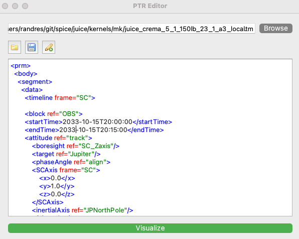

Selecting **Visualize** triggers the background execution of OSVE, generates the required kernels, and creates the corresponding Cosmographia scene. During execution, additional menu entries are registered in Cosmographia to expose plugin-specific functionality.

The added menu entries are described in the following sections.

In the case of 🍎 macOS/ 🐧 Linux the **Timeline Dialog** is automatically displayed after scene creation (see [timeline dialog section](#timeline-dialog-) for details).

The Pointing Editor Dialog can be reopened via the Scenes menu. This menu also provides access to an alternative entry point for generating a basic scene configuration.

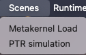

#### Additional entry point Basic Scene Dialog

The Basic Scene Dialog provides a simplified entry point in which the scene is generated directly from the metakernel contents. The user may optionally specify additional kernels to be loaded.

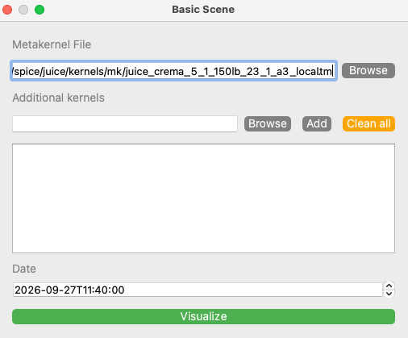

Execution of this entry point also extends the Cosmographia menu system with plugin-specific functionality, as illustrated below.

### Runtime Menu ⚙️

The Runtime Menu provides access to advanced diagnostic and runtime tools intended exclusively for experienced users with prior knowledge of Cosmographia scripting.

The functionality exposed through this menu is primarily intended for debugging, monitoring, and expert-level inspection of the running plugin session. Incorrect usage may lead to inconsistent visualization states or unexpected behavior.

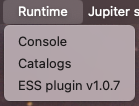

#### Console Dialog

The Console Dialog provides access to a restricted scripting interface for Cosmographia. This interface allows the execution of a limited subset of the Cosmographia scripting language during runtime.

The console is not intended for full scene configuration or persistent modifications. Script execution is limited in scope and is not guaranteed to be stable across plugin versions.

Use of the console requires familiarity with Cosmographia scripting conventions and internal object models.

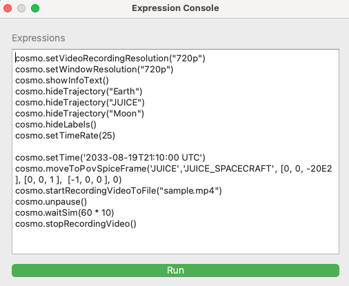

#### Catalog dialog
The Catalog Dialog is intended for monitoring and inspection of Cosmographia catalogs currently loaded at runtime. It provides visibility into the catalogues that are actively being used by Cosmographia during the ongoing visualization session.

Any modification performed through this interface is intended solely for temporary inspection and diagnostic purposes.

Due to its advanced nature, this dialog should be used with caution. Misuse may lead to incomplete or inconsistent visualization states.

‼️ **Danger Zone** 💥 ‼️

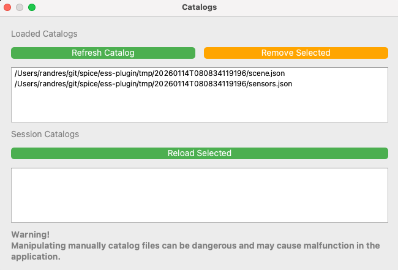

### Pointing Menu 🎯

The Pointing Menu becomes available once a pointing request has been processed by OSVE. It provides access to the execution results and to timeline-based navigation of pointing blocks.

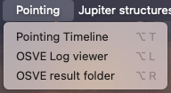

#### Timeline Dialog 🕒
The Timeline Dialog enables navigation through the pointing blocks defined in the request. It is synchronized with Cosmographia’s time control, allowing temporal navigation based on block boundaries.

Observation blocks are displayed as purple segments in an interactive timeline. Slew intervals between observations are represented as gaps.

A summary table below the timeline lists block start and end times, durations, and block content. Double-clicking a block start/end cell updates the scene time to the corresponding instant.

‼️ **Not available in Windows Version** ‼️

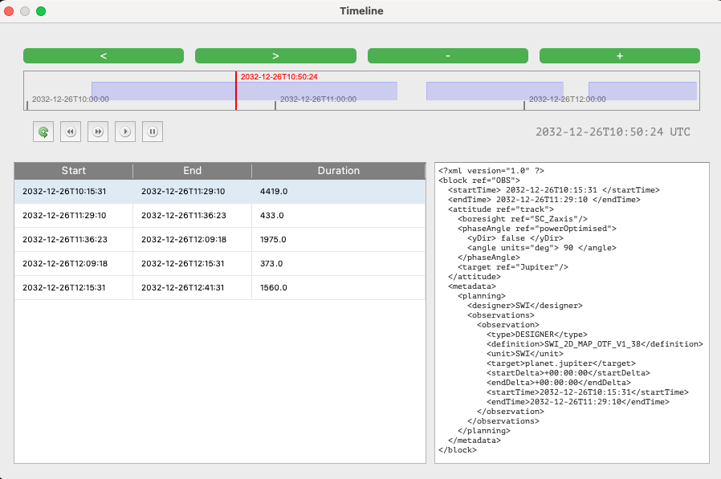

#### OSVE Log Dialog 📝
The OSVE Log Dialog displays the execution log produced by OSVE during processing of the pointing request. Log entries can be filtered, and any constraint violations detected during execution are reported.

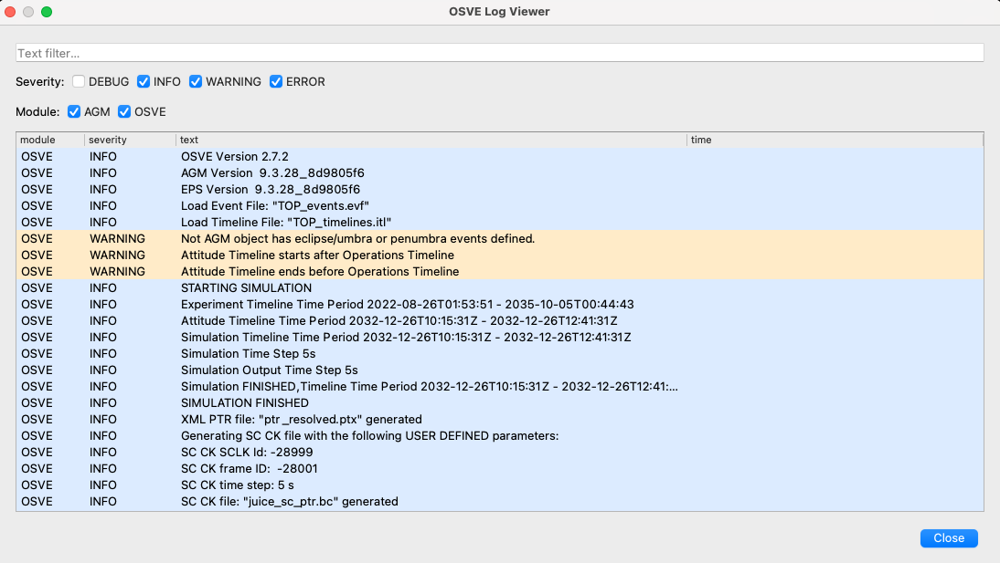

#### OSVE Result Folder 🗂️
Selecting this option opens the OSVE results directory in the local filesystem. The directory contains:

* The OSVE execution log (JSON format)
* The resolved, time-bounded pointing request (XML format)
* The generated SPICE CK file containing the spacecraft attitude (binary format)

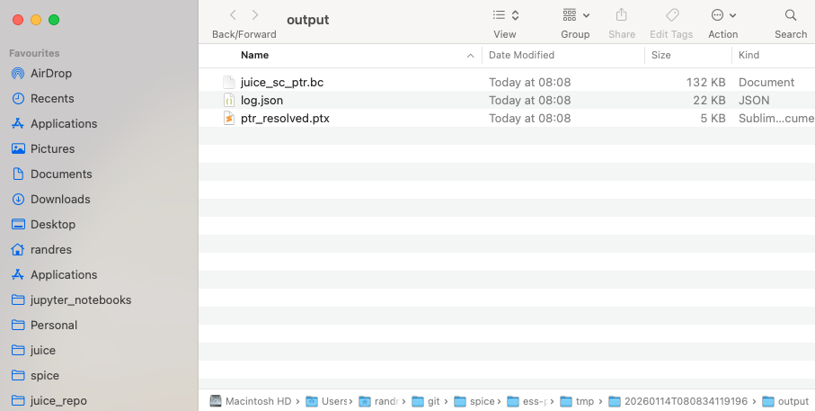

### Jupiter structures Menu 🪐

This menu provides access to dialogs controlling the visualization of Jovian bodies and science structures. The dialogs share a common user interface and allow configuration of visibility and rendering options.

Scientific references and data sources are available through the Help menu.

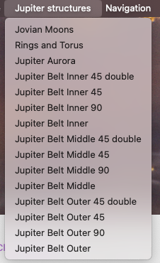

⚠️ **Loading Jupiter belt structures may require significant time and can impact visualization performance**

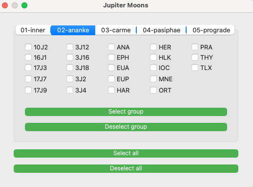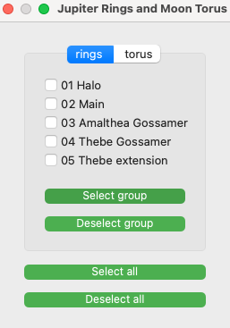

### Navigation Menu 🔭 
The JUICE_PTR plugin is an extension for Cosmographia designed to support the visualization and analysis of spacecraft pointing requests for the JUICE (JUpiter ICy moons Explorer) mission.

The plugin enables the generation of time-accurate 3D scenes based on SPICE kernel data and mission-specific pointing requests, allowing users to assess spacecraft attitude profiles, sensor geometry, and observation sequences within the Jovian system.The Navigation Menu provides access to dialogs controlling sensor visualization and observation management.

#### Sensors Dialog
The Sensors Dialog provides a centralized interface for controlling sensor-related visualization centered on the JUICE spacecraft. Sensors are organized by instrument or unit.

The dialog allows configuration of sensor field-of-view visibility and appearance, as well as predefined view perspectives:

* Sensor View: aligns the camera with the selected sensor
* JUICE: centers the camera on the JUICE spacecraft

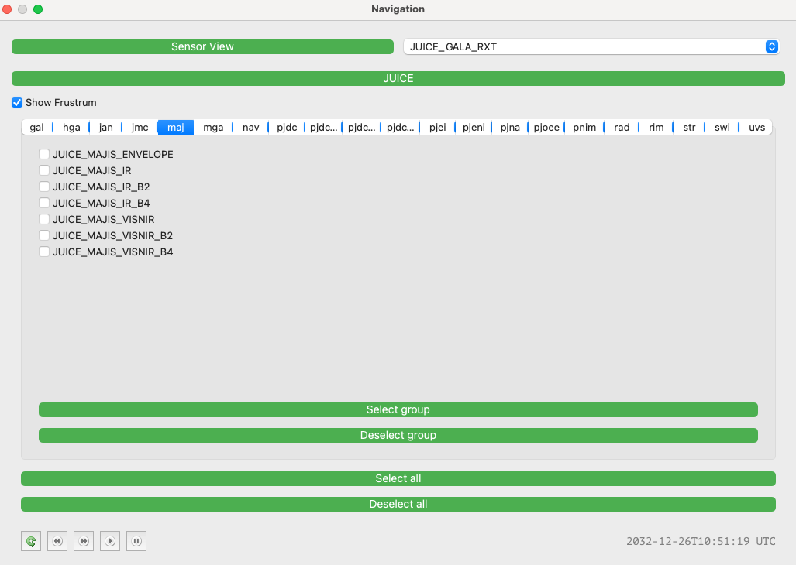

#### Observations Dialog 

The Observations Dialog allows creation and management of sensor observations. This functionality is based on the [Observation Catalogs](https://cosmoguide.org/catalog-file-defining-an-observation/) available in Cosmagraphia. The feature is considered experimental 🧪.

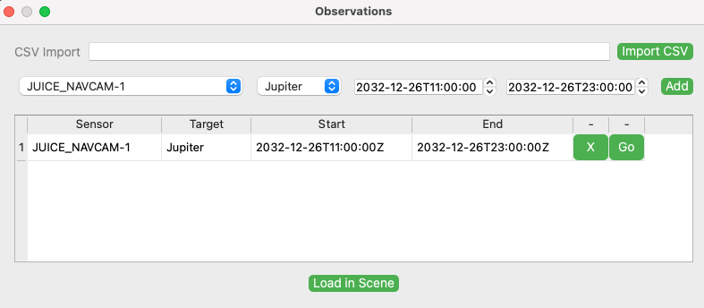

### Help Menu  ℹ️ 
The Help Menu provides access to reference documentation related to plugin functionality. Documentation links also indicate the OSVE version used by the plugin.

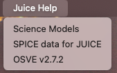

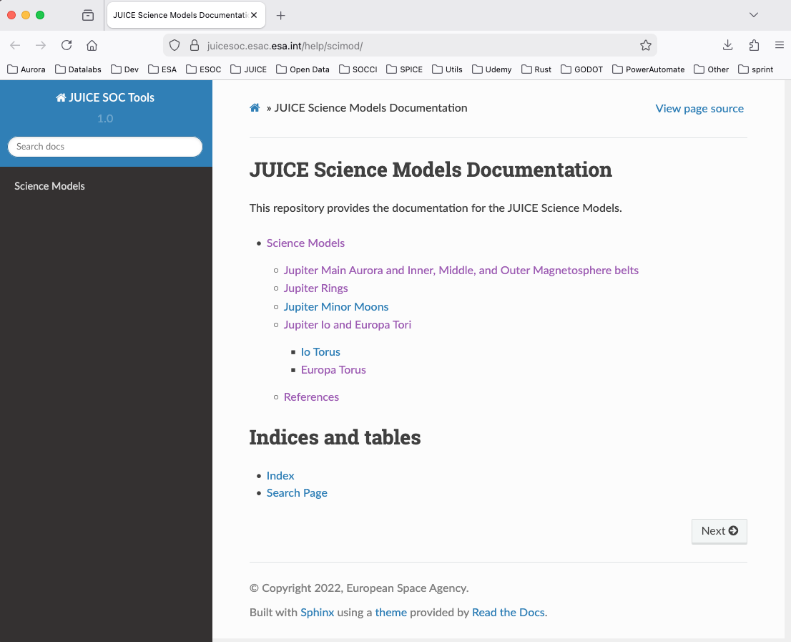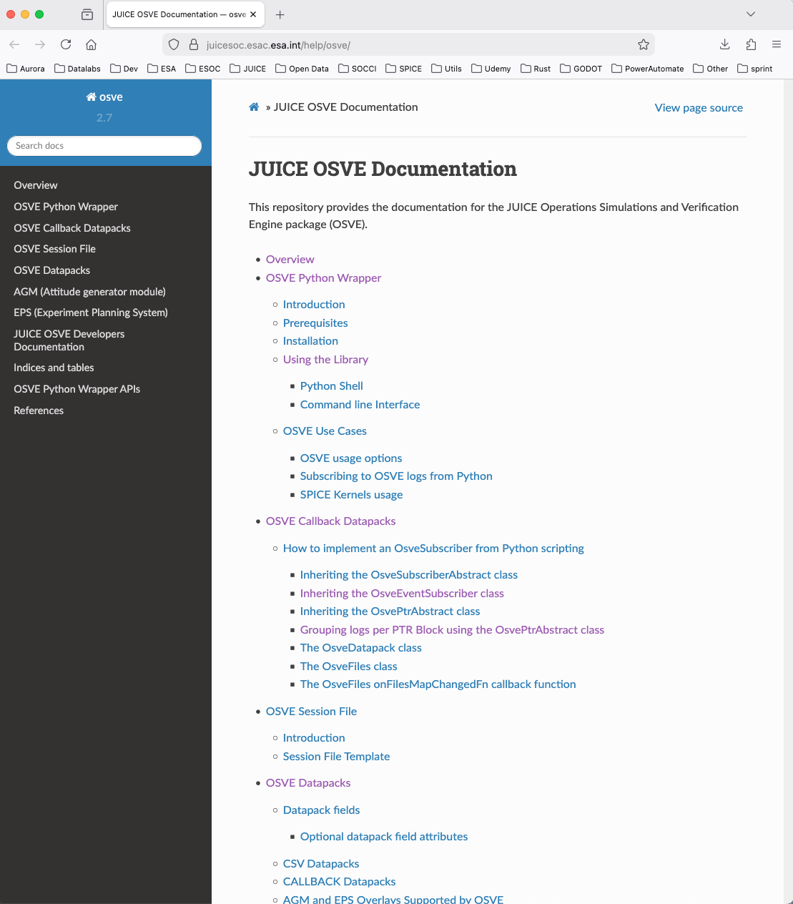

